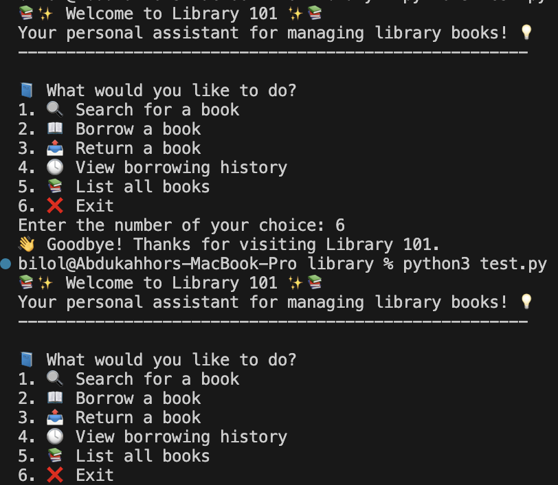

📚 Library 101

Welcome to **Library 101**, a simple and fun Python app to manage books in a library system.

## 🔧 Features

- 🧾 Track book availability
- 🙋‍♀️ Borrow and return books
- 🕓 View borrowing history
- 📚 Search and list all books
- 💾 Easy to expand and customize

## 🚀 Getting Started
1. Clone the repository
# https://github.com/biloltj/library-101.git
# cd library-101
2. Run the app
# python main.py
✅ Python 3.7+ is required.

## 🧠 How It Works
🖼️Photo

💾Video
[text](library-101.mov)

Each book is stored in a dictionary (library.py)
Borrowers and due dates are tracked
You can extend it by saving data to JSON, adding users, or building a GUI!
## 🛠️ Future Improvements

💾 Add persistent file saving/loading (JSON)
🧍‍♂️ User login system
🖼️ GUI with tkinter or PyQt
📊 Admin stats: most borrowed books, overdue books, etc.
## 💬 Contact
Created by Bilol Arzykulov – feel free to reach out if you have questions or ideas!
Let me know and we’ll add it in like a pro 😎